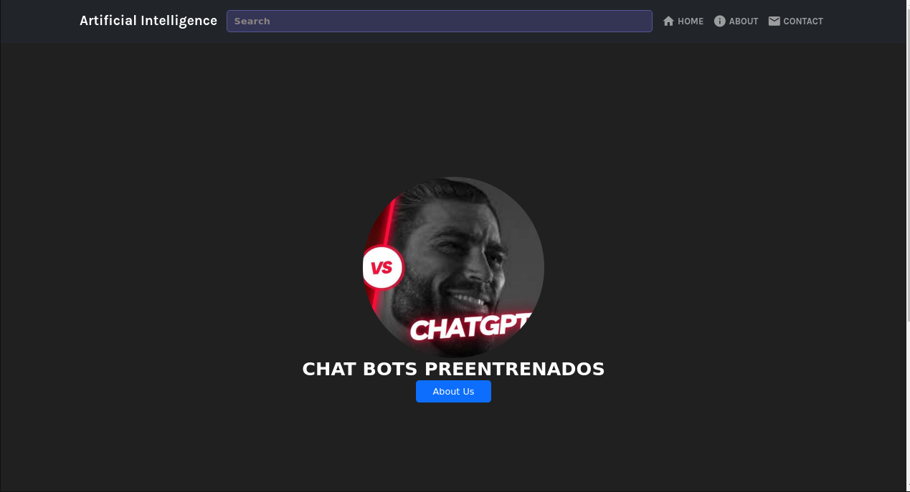

### Mi proyecto de chat bots preentrenados

Este proyecto se centra en el desarrollo de chat bots preentrenados para temas específicos. El objetivo es crear una aplicación que permita a los usuarios interactuar con estos bots de forma natural y eficiente.

**Frontend:**

- Diseño de una interfaz de usuario intuitiva y atractiva.
- Integración de los chat bots preentrenados en la interfaz.
- Implementación de funcionalidades para interactuar con los bots.

**Backend:**

- Configuración de un servidor Node.js/Express.
- Creación de rutas para gestionar las solicitudes de los usuarios.
- Implementación de la lógica de interacción con los chat bots.

**Imagen:**



**Estado actual:**

Actualmente, el proyecto se encuentra en una fase inicial de desarrollo. Se ha realizado un pequeño avance en el frontend, como se muestra en la imagen adjunta. En los próximos días, me centraré en trabajar en el frontend y el backend de la aplicación.


### Instalacion en Linux/MacOS/Windows

Clona el repositorio con <a href='https://www.git-scm.com/'>Git</a>

```sh
git clone https://github.com/rojasricoo/bots-preentrenados.git
```

Dirigete a al directorio

```sh
cd cd bots-preentrenados
```

Instala las dependencias

```sh
npm install
```

ejecuta el servidos

```sh
npm run dev
```
